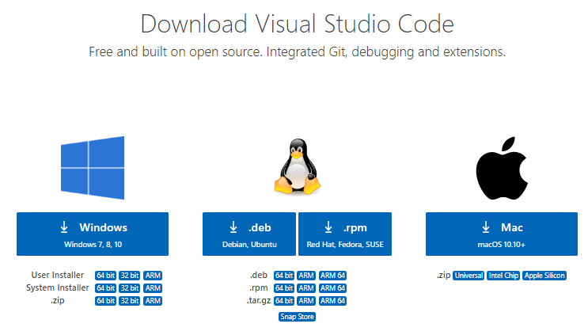
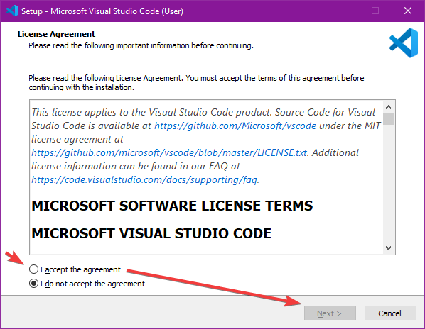
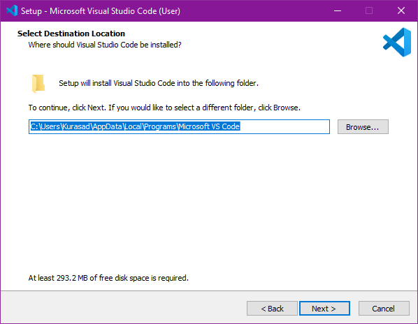
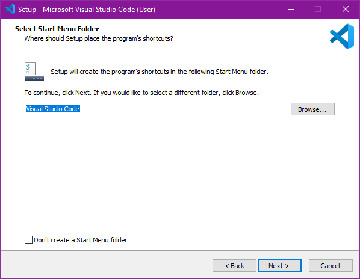
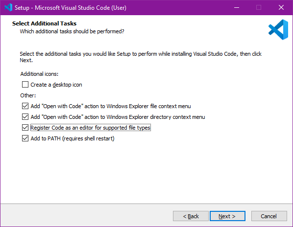
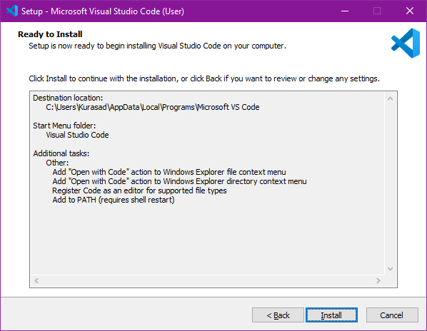
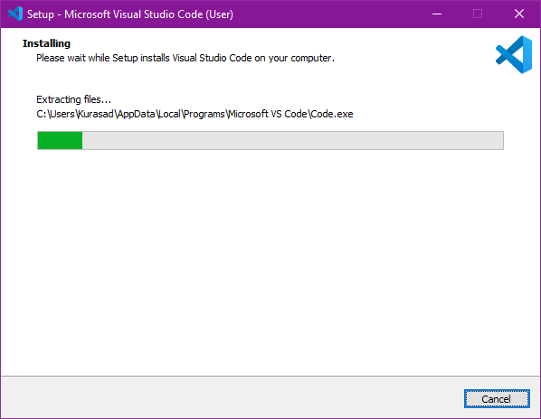
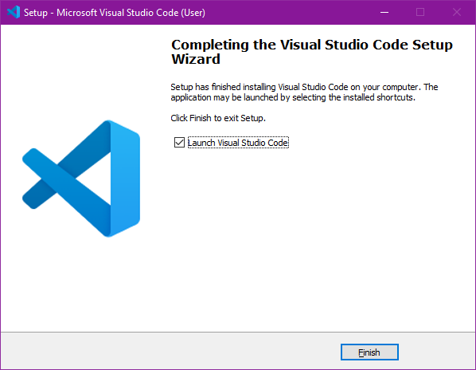

# Day 1 - Setup and Environment Testing

## ❯❯ Table of contents

- **❯❯ Day 1**
    - ❯❯ [About](#-about)
        - ❯❯ [Section 1 - Introduction](#section-1---introduction)
        - ❯❯ [Section 2 - Setup](#section-2---setup)
    - ❯❯ [Recording](resources/records)
    - ❯❯ [Transcript](resources/scripts)
    - ❯❯ [Source Code](src)

## ❯❯ About
Our end goal here is to allow every member of this couse to have the resources and ability to create programs and learn from their mistakes. Lesson 1's main goal is to get the members used to the services necessary for the couse. This includes environment installation and usage.

### Section 1 - Introduction
Hello, my name is Kura and I am here to teach some basics of programming. This class starts with HTML/CSS and will progress onto JS as well as standalone JS applications with the use of Node.JS and Express. 

This class was initially made for helping one person but after a few more people found interest in such a class I have decided to expand this process beyond just a person as well as record the development for future reference and give the students the ability to review the ideas presented.

On the first day it is best to start with introductions of who is experienced in which topics as well as start by setting up the environmental applications necessary for the class. This will explore two important parts of the entire course. First, it will allow me to understand how experienced everyone in the class is in the fields explored and secondly it will let me know how well each person is as following instructions. It is necessary for me to understand how experienced someone is because it will allow me to either give them a task of higher understanding or allow me to spend more time with the people that need help. And having to set up an environment while watching someone else do it will help me understand how much I can depend on someone to interpret the instructions properly.

### Section 2 - Setup

Pre-requisite: A GitHub account.

This section introduces very simple and fast installations of all the necessary applications for the entire course. Since the desired topics to explore are HTML, CSS, JS, Node.JS, Discord.JS and a touch on a few other JS libraries, it is best to install a few prerequisites to make the class easy.

#### Installing Visual Sudio Code
Visual Studio Code (VSC) is the editor that we will be using to create and edit the projects in this couse. Below is the installation guilde for Visual Stuido Code.

#### Step 1: Download
Download at the [Visual Studio Code download page](https://code.visualstudio.com/download) *(Link last updated: 06/07/2021)*

#### Step 2: Install
Follow the instruction guide *(Last updated: 06/07/2021)*.

Agree to the terms and click next.

Keep the default location and click next.

Keep the default value and click next.

Select all options under "other" and click next.

Make sure all the information so far is correct and click next.

Wait for the application to install and click next.

Click finish to open Visual Studio Code.

#### Node.JS
Node.JS is the JavaScript library that we will use to create standalone applications.

Download at the [Node.JS download page](https://nodejs.org/en/download) *(Link last updated: 06/07/2021)*

Check Node.JS installation with: `node -v`

Check NPM installation with: `npm -v`

*Note:* On Windows NPM (Node Package Manager) will be automatically installed with Node.JS.

#### Installing GIT
GIT is a service that is used to connect our code files to GitHub

Download at the [GIT download page](https://git-scm.com/downloads) *(Link last updated: 06/07/2021)*

[Back to top](#day-1---setup-and-environment-testing)
